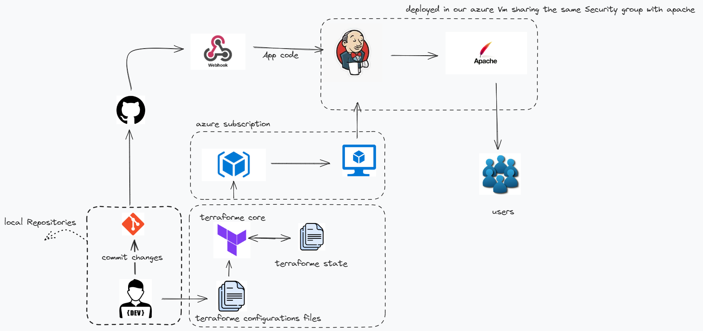
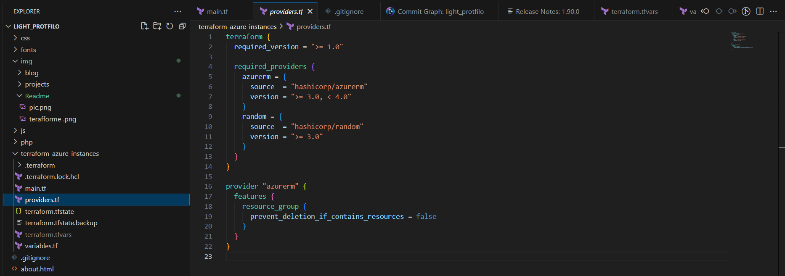
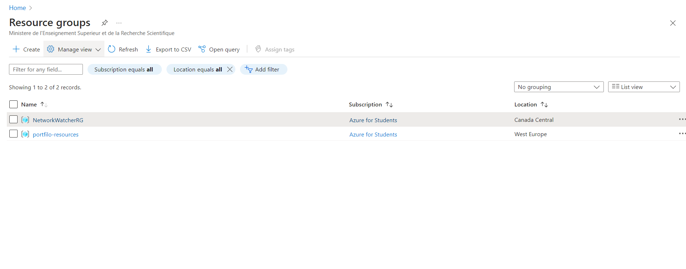
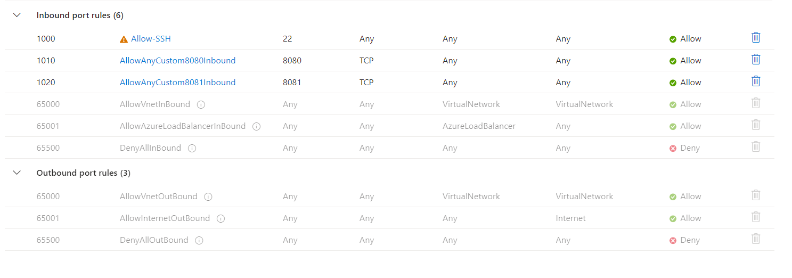
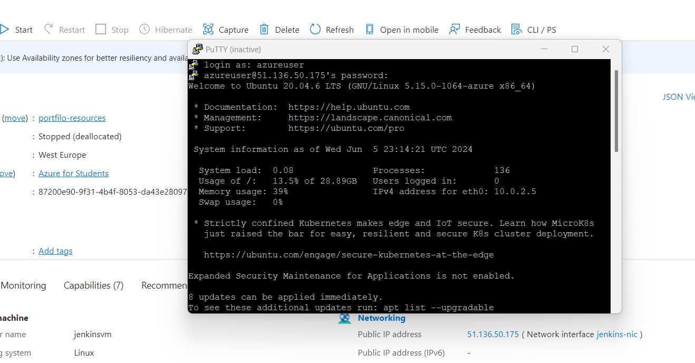
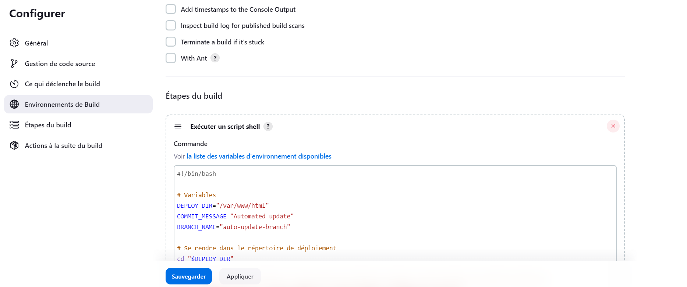

# Automating Infrastructure Deployment with Github, Jenkins, Terraform,Azure

> [!NOTE]
>
> This work may seem complicated and unnecessary for a static website like a portfolio, but I did it as a test to improve my skills. You can apply it to larger projects. This work provides a foundation for changes, even for dynamic websites, and can be used in real, large-scale projects.

**Are you interested of modern development and deployment practices to create a dynamic and automated portfolio website?**
Welcome to the Portfilo Web Project! This project showcases the use of modern development and deployment practices to create a dynamic and automated portfolio website.

## Overview
The Portfilo Web Project is designed to be a personal portfolio website that is automatically updated and deployed using a robust CI/CD pipeline. The project utilizes various technologies and tools to ensure a smooth and automated workflow from code changes to deployment.
## Technologies
* **HTML/CSS/JavaScript:** For the front-end design and interactivity.
* **Git:** For version control.
* **GitHub:** For repository hosting and collaboration.
* **Jenkins:** For Continuous Integration and Continuous Deployment (CI/CD).
* **Terraform:** For Infrastructure as Code (IaC) to provision and manage the virtual machine.
* **Azure:** For cloud infrastructure, hosting the virtual machine.
* **Apache:** As the web server to serve the portfolio websit

## Key Features
* **Automated Deployment:** The project utilizes Jenkins and Terraform for automated deployment, ensuring efficient and consistent deployment of updates to the portfolio website.

* **Continuous Integration and Continuous Deployment (CI/CD):** Leveraging Jenkins, the project implements CI/CD pipelines to automate the building, testing, and deployment processes, reducing manual intervention and ensuring rapid delivery of changes.

* **GitHub Integration:** Changes pushed to the GitHub repository trigger automated builds and deployments, streamlining the development workflow and enabling seamless collaboration among team members.

* **Infrastructure as Code (IaC):** Terraform is used to provision and manage the cloud infrastructure on Azure, enabling the project to define infrastructure components programmatically and maintain infrastructure configurations in version control.

* **Dynamic Web Content:** Although initially designed for a static portfolio website, the project's architecture and automation allow for easy adaptation to dynamic web content, making it suitable for scaling to larger and more complex web applications.
## Benefits
  * **Efficiency:** Saves time and reduces errors through automated deployment.
  * **Scalability:** Easily adaptable for larger portfolios or dynamic websites.
  * **Flexibility:** Highly customizable to suit various requirements.
## How it Works
This diagram will give you an overview of how it works, and we will then proceed to examine each step in detail. 
 
1.The first step is to develop your own portfolio or any other web project. 
2.The second step is to create a repository on GitHub and link it with your local repository. 
3.Create a folder and write the Terraform code, then connect your Azure account with Terraform. 

4.Run the Terraform init command. 
5.Execute the Terraform plan command. 
6.Apply the Terraform apply command. 
7.Go to your Azure portal, navigate to the virtual machine section, and refresh to find the VM created via Terraform. 

8.Now, go to the VM settings, then Networking (inbound port rules), and add port rules to allow SSH connections using tools like PuTTY, and open ports 8080 for Jenkins server and 8081 for our portfolio deployment. 

9.Connect to your VM via PuTTY. 

10.Install Jenkins. 
11.After installation, access Jenkins by navigating to <public IP address>:8080 and configure Jenkins. 

12.Create a webhook and link it with Jenkins. 

13.Install Apache. 
14.Create a Jenkins script that updates the changes in /var/www/html with every update. 
15.Configure Apache to run on port 8081. 
> [!important]
>
> **Citation:**
>
> Ben Abdallah A (2024)personal project :Automating Infrastructure Deployment with Github, Jenkins, Terraform,Azure. URL: [https://github.com/achrafbenabdalla/protfilo-web.git)
